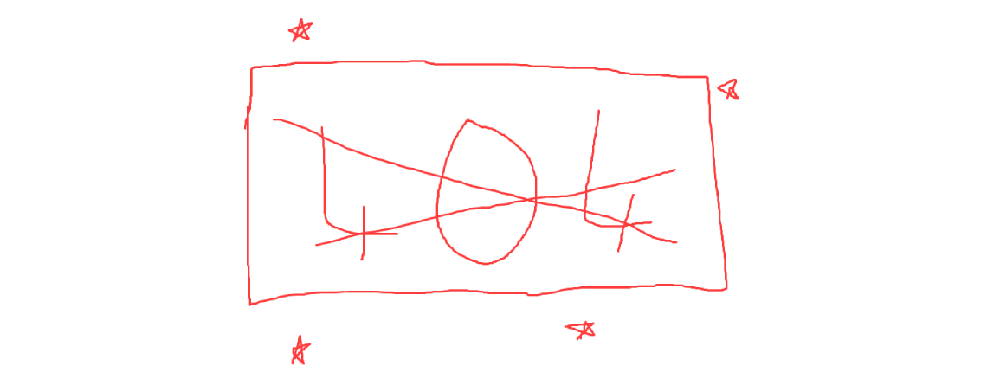

<h1 align="center">No404</h1>

The extension listens to the websites you visit and gives you access to their archived versions on the Internet Archive .

## Why?

I dislike clicking on random websites, especially old ones, and finding a 404 error.
It's a lot of work to copy the link, go to archive.org, paste the link, and look for the right date. So, I made this extension :)

and to sharpen my vanilla js skills.

## Why it's not available in chrome store
I ain't paying anything for a side project.

